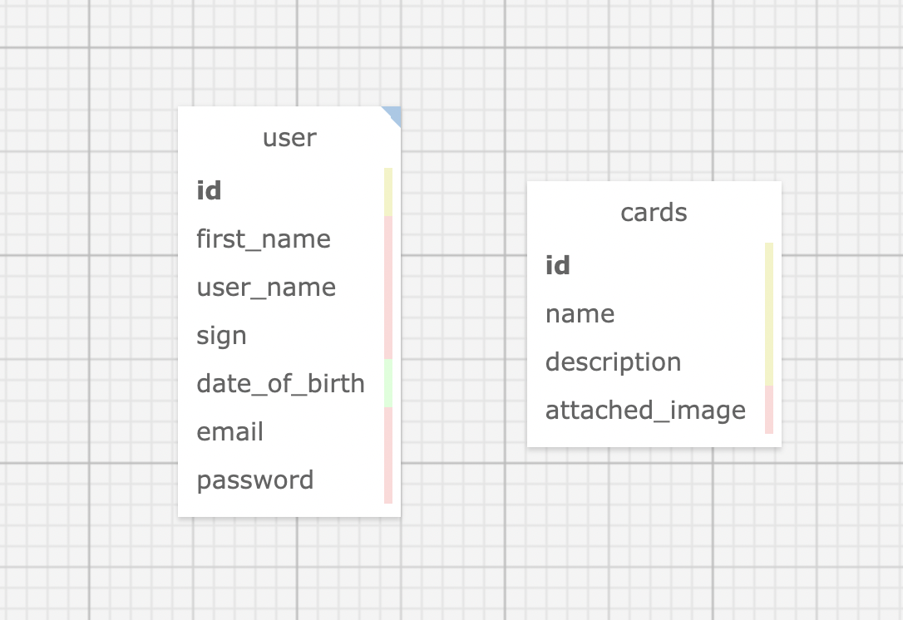

# _Tarot Card Reader_

#### _Ruby on Rails Team Week project for Epicodus Bootcamp_

#### Created By: **Frank Proulx, Christopher Neal, Morgan Waites, Isaac Overstreet, Matt Casperson**

## Technologies Used

* _Ruby_
* _Gems_
* _Bundler_
* _CSS_
* _coffeescript_
* _IRB_
* _Pry_
* _Postgres_
* _SQL_
* _SQL Designer_
* _Rails_
* _ActiveRecord_
* _Bootstrap SCSS_
* _Faker_
* _Devise_

## Description

_This project was created for Epicodus bootcamp as a Team Week project to show proficiency in Ruby on Rails. A user can get learn about tarot cards, get either a three-card or ten-card tarot card reading._

## Database Schema

## System Requirements

* Ruby v2.6.5 recommended
* Postgres 12.9  
_(Note: Ruby gem dependencies will be installed automatically by Bundler.)_

## Setup/Installation Requirements

* Clone the GitHub repository: [https://github.com/Frank-Proulx/tarot_card_reader](https://github.com/Frank-Proulx/tarot_card_reader)
* From the main project directory, enter `bundle install` in the terminal to populate gems.
* To create a database, run `rake db:setup` in your terminal.
* To seed the database, run `rake db:seed` and ensure that the terminal output prints `Created 78 cards! (should be 78)`.
* Run `rails s` to start the Rails server.
* Open browswer and enter the url http://localhost:3000/ unless otherwise prompted in the terminal.

## Known Bugs

* _Turboload causes navbar links to load page twice in some cases._

## License

_[MIT](https://opensource.org/licenses/MIT)_
Copyright (c) _2022_ _Frank Proulx, Christopher Neal, Morgan Waites, Isaac Overstreet, Matt Casperson_

## Support and Contact Details
* _[christopher.m.neal@gmail.com](mailto:christopher.m.neal@gmail.com)_